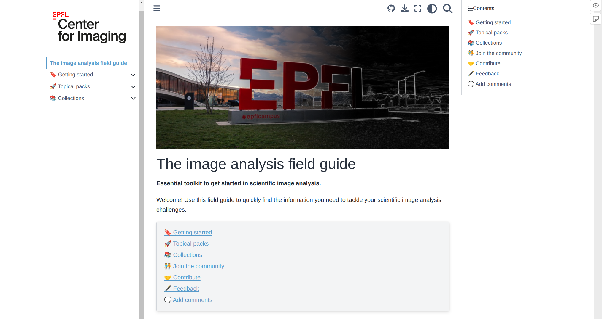

# The Image Analysis Field Guide

Essential toolkit to get started in scientific image analysis.

👉 See the live website at [this URL](https://imaging.epfl.ch/field-guide/).

**Help us improve the site**

✒️ We're running a [survey](https://docs.google.com/forms/d/e/1FAIpQLScl3ho-P_F_vO-wSG1CLJCkxEipImF0cQuY_l_o12CRWbKp0Q/viewform?usp=sf_link) to find out how we can improve the site. Don't hesitate to respond!

-------------------------

## Installation

Install the packages required to build the book:

```
pip install -r requirements.txt
```

If you wnat to execute the notebooks, install the scientific packages listed in the `notebooks/` folder ([requirements.txt](src/sections/exploring_further/notebook_case_studies/notebooks/requirements.txt)).

## Build the Jupyter book

```
jupyter-book build src/
```

Then, drag and drop `_build/html/index.html` in a web browser.

To check external links:

```
jb build src --builder linkcheck
```

## Build and run with `docker`

Build the image (for the given URLs of your site and JupyterHub):

```
docker build \
  --build-arg NOTION_KEY=$NOTION_KEY \
  --build-arg DEPLOY_URL=http://localhost:8080/ \
  --build-arg JUPYTERHUB_HOST=localhost \
  --build-arg JUPYTERHUB_PORT=8000 \
  -t $(whoami)/$(basename ${PWD}) .
```

Run the jupyter book in a container on `http://localhost:8080/`.

Quick test:

```
docker run --rm -it -p 8080:80 $(whoami)/$(basename ${PWD}):latest
```

Persistent:

```
docker run -dp 8080:80 --name image-analysis-field-guide $(whoami)/$(basename ${PWD}):latest
```

## Contribute

See [contribute](./CONTRIBUTING.md).

## Roadmap

See [roadmap](./roadmap.md).