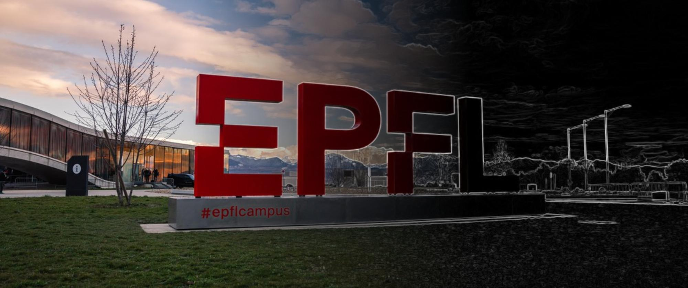

# The image analysis field guide

**Essential toolkit to get started in scientific image analysis.**

Welcome! Use this field guide to quickly find the information you need to tackle your scientific image analysis challenges.

```{contents}
:local:
```

## 🔖 Getting started

These are our favourite **resources** for learning the basics of image analysis:

````{grid} 1 1 2 3
```{grid-item-card}
:link: https://biapol.github.io/Image-data-science-with-Python-and-Napari-EPFL2022/intro.html
:img-top: https://biapol.github.io/Image-data-science-with-Python-and-Napari-EPFL2022/_static/biapol_logo.png
:text-align: center
Image data science with Python and Napari @EPFL
```
```{grid-item-card}
:link: https://courseware.epfl.ch/courses/course-v1:EPFL+IPA4LS+2019_t3/about
:img-top: https://pbs.twimg.com/profile_images/958000343970992129/UbfSyOtp_400x400.jpg
:text-align: center
Image Processing and Analysis for Life Scientists
```
```{grid-item-card}
:link: https://bioimagebook.github.io/README.html
:img-top: https://bioimagebook.github.io/_static/book-logo-smaller.png
:text-align: center
Introduction to Bioimage Analysis
```
````

Here's a short list of image analysis **software** that we recommend:

````{grid} 1 1 2 4
```{grid-item-card}
:link: https://fiji.sc/
:img-top: https://upload.wikimedia.org/wikipedia/commons/5/55/FIJI_(software)_Logo.svg
:text-align: center
Fiji
```
```{grid-item-card}
:link: https://www.ilastik.org/
:img-top: ./images/ilastik_square.jpeg
:text-align: center
Ilastik
```
```{grid-item-card}
:link: https://napari.org/
:img-top: https://napari-staging-site.github.io/_static/logo.ico
:text-align: center
Napari
```
```{grid-item-card}
:link: https://qupath.github.io/
:img-top: https://chanzuckerberg.com/wp-content/uploads/2019/11/QuPath_logo-Pete-Bankhead.png
:text-align: center
QuPath
```
````

Read our **setup guide**:

````{grid} 1 1 2 3
```{grid-item-card} Setting up Python for scientific image analysis
:link: ./sections/python_setup.html
:img-top: https://i0.wp.com/www.inferencelab.com/wp-content/uploads/Python-logo-notext.svg_.png
:text-align: center
```
````

## 🚀 Topical packs

````{margin}
```{tip}
Use `Ctrl+K` to search this site!
```
````
Delve deeper into individual topics.

````{grid} 1 1 2 3
```{grid-item-card}
:img-top: ./images/segmentation_tm.jpeg
:link: ./sections/starter_packs/image_segmentation.html
:text-align: center
Image segmentation
```
```{grid-item-card}
:link: ./sections/starter_packs/image_registration.html
:img-top: ./images/registration_tm.jpeg
:text-align: center
Image registration
```
```{grid-item-card}
:link: ./sections/starter_packs/image_denoising.html
:img-top: ./images/denoising_tm.jpeg
:text-align: center
Image denoising
```
````
````{grid} 1 1 2 3
```{grid-item-card}
:link: ./sections/starter_packs/detection_and_tracking.html
:img-top: ./images/tracking_tm.jpeg
:text-align: center
Object detection and tracking
```
```{grid-item-card}
:link: ./sections/starter_packs/image_data_visualization.html
:img-top: ./images/visualization_tm.jpeg
:text-align: center
Image data visualization
```
```{grid-item-card}
:link: ./sections/starter_packs/performance_optimization.html
:img-top: ./images/performance_tm.jpeg
:text-align: center
Performance optimization
```
````

## 📚 Collections

Browse our curated lists of online resources, software tools, and tutorials on the topic of scientific image analysis.

````{grid} 1 1 2 3
```{grid-item-card} Learning resources
:link: ./sections/online_resources.html
:img-top: https://raw.githubusercontent.com/Tarikul-Islam-Anik/Animated-Fluent-Emojis/master/Emojis/Objects/Graduation%20Cap.png
:text-align: center
```
```{grid-item-card} Software tools
:link: ./sections/software_tools.html
:img-top: https://raw.githubusercontent.com/Tarikul-Islam-Anik/Animated-Fluent-Emojis/master/Emojis/Objects/Hammer%20and%20Wrench.png
:text-align: center
```
```{grid-item-card} Tutorials
:link: ./sections/tutorials.html
:img-top: https://raw.githubusercontent.com/Tarikul-Islam-Anik/Animated-Fluent-Emojis/master/Emojis/Animals/Seedling.png
:text-align: center
```
````


## 💡 Example projects

`````{margin}
````{admonition} Launch the notebooks
If you are in EPFL, you can launch the notebooks to run them interactively on our `Jupyter Hub` by clicking on the rocket icon at the top of a notebook page.
```{image} ./images/jupyterhub.jpeg
:align: center
```
````
`````

Browse our collection of example image analysis projects done in collaboration with EPFL labs and presented as Jupyter notebooks.


```{nblinkgallery}
:glob:
sections/epfl_case_studies/*
```

## 🧑‍🤝‍🧑 Join the community

If you are in EPFL, you can join our *Matrix server* by connecting to [element.epfl.ch](https://element.epfl.ch/).


````{grid} 1 1 2 3
```{grid-item-card} Contribute
:link: https://github.com/EPFL-Center-for-Imaging/image-analysis-field-guide/blob/main/CONTRIBUTING.md
:img-top: https://raw.githubusercontent.com/Tarikul-Islam-Anik/Animated-Fluent-Emojis/master/Emojis/Objects/Microscope.png
:text-align: center
Read our guide to find out how you can contribute to our project.
```
```{grid-item-card} Feedback
:link: https://forms.gle/toHAP2ydydXBCndGA
:img-top: https://raw.githubusercontent.com/Tarikul-Islam-Anik/Animated-Fluent-Emojis/master/Emojis/Objects/Black%20Nib.png
:text-align: center
Please fill-in our survey form. We'd love to hear your opinion about our site!
```
```{grid-item-card} Image.sc
:link: https://image.sc/
:img-top: https://global.discourse-cdn.com/business4/uploads/imagej/original/2X/4/4904e8fe196486eabdbe0d9d185e94dfcab74e10.png
:text-align: center
Our favourite online forum on image analysis.
```
````