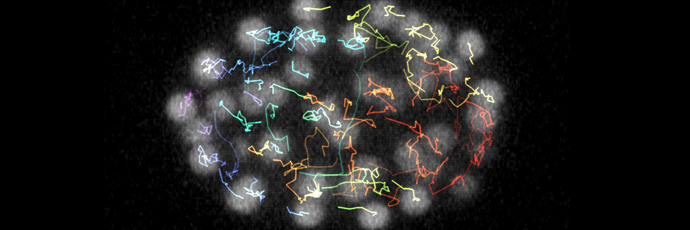

---
jupytext:
  text_representation:
    extension: .md
    format_name: myst
    format_version: 0.13
    jupytext_version: 1.16.0

---
```{code-cell} ipython3
:tags: [remove-input]
tags = ["Object detection", "Tracking"]
from itables import init_notebook_mode
from pathlib import Path
import sys
sys.path.append(str(Path.cwd().parents[1]))
from helpers import *
init_notebook_mode(all_interactive=True, connected=True)
```


# 🐾 Object detection and tracking

````{margin}
```{admonition} Acknowledgements
This topic has been curated by **Mallory Wittwer**.

Contact: [✉️ Email](mailto:mallory.wittwer@epfl.ch)
```
````

Objects of interest can be detected via keypoints, bounding boxes, shapes (e.g. lines, circles), or segmentation masks. In timeseries (movies), following objects across frames is known as tracking.

## 🎓 Learning resources

Here is our curated list of free online resources on the topic of object detection and tracking.

```{code-cell} ipython3
:tags: [remove-input]

df = filter_online_resources(tags)
show_online_resources(df, dom="tr")
```

## 🌱 Tutorials

Check out our tutorial notebooks related to object detection and tracking.

```{nblinkgallery}
:glob:
./notebooks/*
```

## 🛠️ Software tools

Take a look at these software tools to help you solve your object detection and tracking problems.

```{code-cell} ipython3
:tags: [remove-input]

df = filter_software_tools(tags)
show_software_tools(df)
```