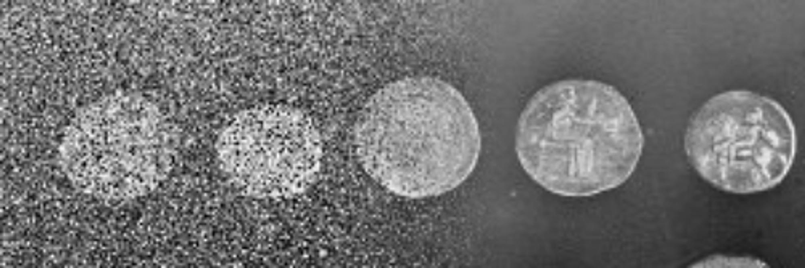

---
jupytext:
  text_representation:
    extension: .md
    format_name: myst
    format_version: 0.13
    jupytext_version: 1.16.0

---
```{code-cell} ipython3
:tags: [remove-input]
tags = ["Image denoising"]
from itables import init_notebook_mode
from pathlib import Path
import sys
sys.path.append(str(Path.cwd().parents[1]))
from helpers import *
init_notebook_mode(all_interactive=True, connected=True)
```


# 🪄 Image denoising

````{margin}
```{admonition} Acknowledgements
This topic has been curated by **Mallory Wittwer**.

Contact: [✉️ Email](mailto:mallory.wittwer@epfl.ch)
```
````

Image denoising is used to generate images with high visual quality, in which structures are easily distinguishable and noise is removed. Denoised images are often more amendable to thresholding for segmentation.

## 🎓 Learning resources

Here is our curated list of free online resources on the topic of image denoising.
src/images/visualization_lg.jpeg src/images/viewer_icons.jpeg
```{code-cell} ipython3
:tags: [remove-input]

df = filter_online_resources(tags)
show_online_resources(df, dom="tr")
```

## 🌱 Tutorials

Check out our tutorial notebooks related to image denoising.

```{nblinkgallery}
:glob:
./notebooks/*
```

## 🛠️ Software tools

Take a look at these software tools to help you solve your image denoising problems.

```{code-cell} ipython3
:tags: [remove-input]

df = filter_software_tools(tags)
show_software_tools(df)
```