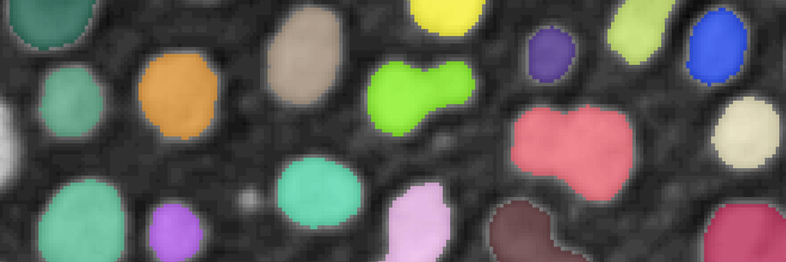

---
jupytext:
  text_representation:
    extension: .md
    format_name: myst
    format_version: 0.13
    jupytext_version: 1.16.0

---
```{code-cell} ipython3
:tags: [remove-input]
tags = ["Image segmentation"]
from itables import init_notebook_mode
from pathlib import Path
import sys
sys.path.append(str(Path.cwd().parents[1]))
from helpers import *
init_notebook_mode(all_interactive=True, connected=True)
```


# ✂️ Image segmentation

````{margin}
```{admonition} Acknowledgements
This topic has been curated by **Mallory Wittwer**.

Contact: [✉️ Email](mailto:mallory.wittwer@epfl.ch)
```
````

Image segmentation aims to produce a segmentation mask that identifies a particular class or object. Various techniques can be used for image segmentation, including thresholding, weakly supervised learning (Ilastik, Weka...) or deep learning.

## 🎓 Learning resources

Here is our curated list of free online resources on the topic of image segmentation.

```{code-cell} ipython3
:tags: [remove-input]

df = filter_online_resources(tags)
show_online_resources(df, dom="tr")
```

## 🌱 Tutorials

Check out our tutorial notebooks related to image segmentation.

```{nblinkgallery}
:glob:
./notebooks/*
```

## 🛠️ Software tools

Take a look at these software tools to help you solve your image segmentation problems.

```{code-cell} ipython3
:tags: [remove-input]

df = filter_software_tools(tags)
show_software_tools(df)
```